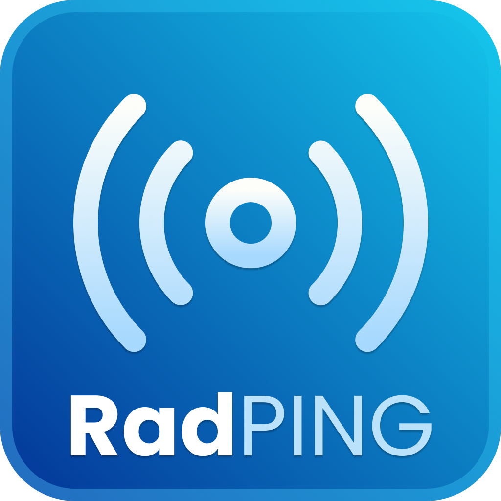

<p align="center">
  
</p>

<h1 align="center">RadPING</h1>

<p align="center">
  A modern, cross-platform RADIUS test client.<br>
  Send authentication and accounting requests, and read back every attribute in the reply — decoded, not as raw hex.
</p>

<p align="center">
  
  
  
  
</p>

---

RadPING is a spiritual successor to MasterSoft's **NTRadPing** — the classic,
Windows-only RADIUS test utility from the early 2000s. It does the same job with
a clean, modern interface and runs natively on macOS, Windows, and Linux.

Point it at a RADIUS server, build a request, and inspect the response code and
every returned attribute, decoded by name and type.

> **Status:** early and actively developed (v0.1). Authentication and accounting
> requests work today — see the [roadmap](#roadmap).

## Features

- **Authentication requests** — `Access-Request` with **PAP** or **CHAP**,
  including correct `User-Password` hiding and CHAP-Challenge handling (RFC 2865).
- **Accounting requests** — `Accounting-Request` for Start, Stop, Interim-Update,
  On, and Off (RFC 2866), with a valid request authenticator.
- **Response validation** — verifies the Response Authenticator and flags a
  mismatched shared secret.
- **Decoded replies** — every attribute shown by name and type in a clean table,
  with round-trip time and the raw packet bytes one click away.
- **Vendor-Specific Attributes** — attribute 26 is unpacked into its vendor
  sub-attributes. Built-in support for Cisco, Microsoft, MikroTik, Aruba,
  Fortinet, Juniper, and WISPr; unknown vendors still decode structurally
  instead of as one opaque hex blob.
- **Custom dictionaries** — import standard FreeRADIUS `dictionary` files to name
  and type Vendor-Specific Attributes from any vendor. Imports persist across
  launches.
- **Server profiles** — save connection details (host, port, secret, timeout,
  retries) per server and reload them from a dropdown. Shared secrets are
  encrypted at rest with the OS keychain (Keychain / DPAPI / libsecret).
- **Free-form attributes** — add any standard attribute to a request from a
  built-in RFC 2865/2866 dictionary, with named enum values.
- **Update notifications** — on launch, RadPING checks GitHub Releases and shows
  an unobtrusive prompt when a newer version is available. It never downloads or
  installs anything on its own — clicking it just opens the Releases page.

## Getting started

### Download

Grab the latest build from the
[**Releases**](https://github.com/MooseTheCoder/RadPING/releases) page, or build
from source below.

### Build from source

Requires [Node.js](https://nodejs.org/) 18 or newer.

```bash
git clone https://github.com/MooseTheCoder/RadPING.git
cd RadPING
npm install
npm start
```

### Package installers

```bash
npm run dist:mac           # .dmg + .zip (drag-to-run app)
npm run dist:win           # NSIS installer + portable folder (.zip) + portable .exe
npm run dist:win:portable  # portable folder (.zip) only
npm run dist:linux         # AppImage (portable) + .deb
```

### Portable on Windows

There are two portable shapes, for different needs:

- **Portable folder (`.zip`) — recommended.** An unpacked app folder containing a
  real, permanent `RadPING.exe`. Extract it anywhere (USB stick, network share),
  run `RadPING.exe`, and **you can pin it to the taskbar** and it re-opens
  reliably. To keep settings inside the folder, drop an empty file named
  `portable.txt` next to `RadPING.exe`; RadPING then stores profiles and
  dictionaries in a `RadPING-data` subfolder instead of `%APPDATA%`.
- **Portable `.exe`.** A single self-extracting file — convenient to hand around,
  and it stores its data next to itself automatically. Note it unpacks and runs
  from a temporary folder, so it is **not suitable for pinning to the taskbar**
  (Windows would pin the temporary path). Use the portable folder for that.

The Linux **AppImage** and the macOS **.zip** are portable in the same spirit.

## Usage

1. Enter the **RADIUS server**, **port** (1812 for authentication, 1813 for
   accounting), and **shared secret**.
2. Choose a **request type**. For authentication, pick **PAP** or **CHAP** and
   enter a username and password.
3. Add any **additional attributes** you need (e.g. `NAS-IP-Address`,
   `Service-Type`). Accounting requests usually also need `Acct-Session-Id`.
4. Click **Send Request** and read the result: a colour-coded status
   (Accept / Reject / Challenge), the returned attributes, and — if you want it —
   the raw request/response hex.

Save a connection as a **profile** to reuse it later, and open **Dictionaries**
to import vendor dictionaries for richer Vendor-Specific Attribute decoding.

## Supported RADIUS

| Capability | Status |
| --- | --- |
| Access-Request — PAP | Supported |
| Access-Request — CHAP | Supported |
| Accounting-Request — Start / Stop / Interim / On / Off | Supported |
| Response Authenticator validation | Supported |
| Standard attributes (RFC 2865 / 2866) | Supported |
| Vendor-Specific Attribute decoding | Supported |
| Custom FreeRADIUS dictionaries | Supported |
| EAP / Message-Authenticator | Planned |
| Sending Vendor-Specific Attributes | Planned |

## Development

There is no bundler and no build step for the app itself: the renderer is plain
HTML/CSS/JS, and all networking (UDP sockets, MD5, packet encode/decode) lives in
the Electron main process, reached from the sandboxed renderer over a narrow
`contextIsolation` bridge.

Run the test suites (plain Node, no framework, no Electron required):

```bash
npm test
```

```
electron/     Electron main process, IPC handlers, preload bridge
src/radius/   RADIUS protocol — dictionary, vendors, packet, client, dictparser
src/store/    persisted server profiles and imported dictionaries
renderer/     the UI (index.html, styles.css, app.js)
assets/       application icon
test/         plain-Node test suites
```

## Roadmap

- Full request templates (username + attributes) built on server profiles
- EAP and Message-Authenticator support
- Sending Vendor-Specific Attributes (a VSA editor)
- Named enum values for vendor integer attributes in decoded replies
- Request history and repeat

## Contributing

Issues and pull requests are welcome. For substantial changes, please open an
issue first to discuss the direction, and run `npm test` before submitting.

## License

RadPING is free software: you can redistribute it and/or modify it under the
terms of the **GNU General Public License v3.0** (or, at your option, any later
version) as published by the Free Software Foundation.

See [LICENSE](./LICENSE) for the full text.

## Credits

Inspired by MasterSoft's original **NTRadPing**. RadPING is an independent
project and is not affiliated with or endorsed by MasterSoft.

## AI Disclosure

Project built using Claude Code.
